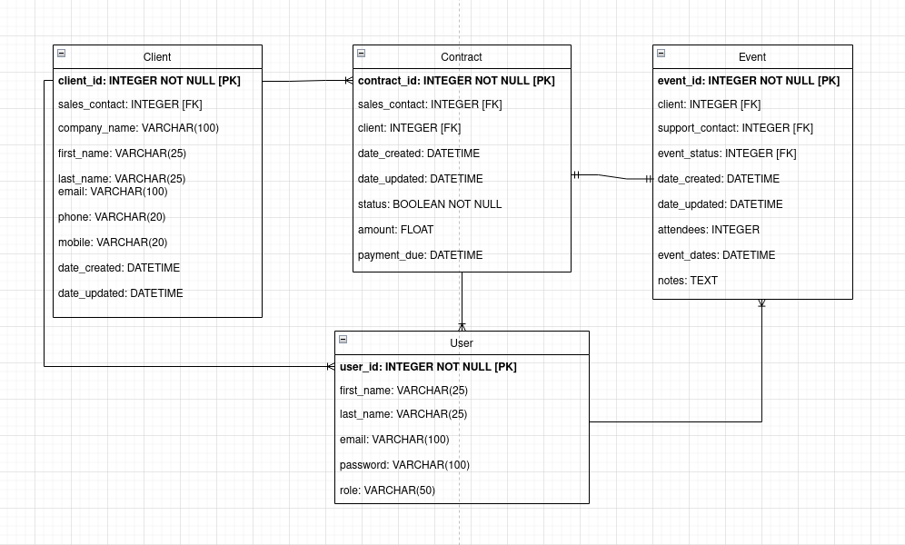

# Openclassrooms Project 12
Develop a secure back-end Architecture using Django ORM

## Epic Events API

CRM (Customer Relationship Management) application.
Used to create clients, add contracts and if they are signed add events to them.

## Entity Relationship Diagram


## Epic Events Documentation

https://documenter.getpostman.com/view/19912950/UzJFwyWQ


Main features :
- User Authentication (using JSON Web Token)
- Manage accounts with three different roles with permissions
- 1 Manager: Manage accounts, assign users roles, have access and can modify all data.
- 2 Support: Manage the events assigned to them by the sales users, can only read data and update their events.
- 3 Sales: Manage the creation of clients, contracts, events and assign support or sales users to them.

## Installation

Python (version used: 3.8.10)
* [Download Python](https://www.python.org/downloads/) 

Download the application
```
git clone https://github.com/Mathieusc/openclassrooms_project_12.git
cd openclassrooms_project_12/
```

Create a virutal environment
```
python3 -m venv env
```

Linux :
```
source env/bin/activate
```

Windows :
```
.\env\Scripts\Activate
```

Install dependencies
```
pip install -r requirements.txt
```

Create the database
```
python manage.py migrate
```

Create the admin account
```
python manage.py createsuperuser
```

Run the server
```
python manage.py runserver
```


## Created with
Python version 3.8.10
* [Visual Studio Code](https://code.visualstudio.com/) 
* [Postman](https://www.postman.com/)
